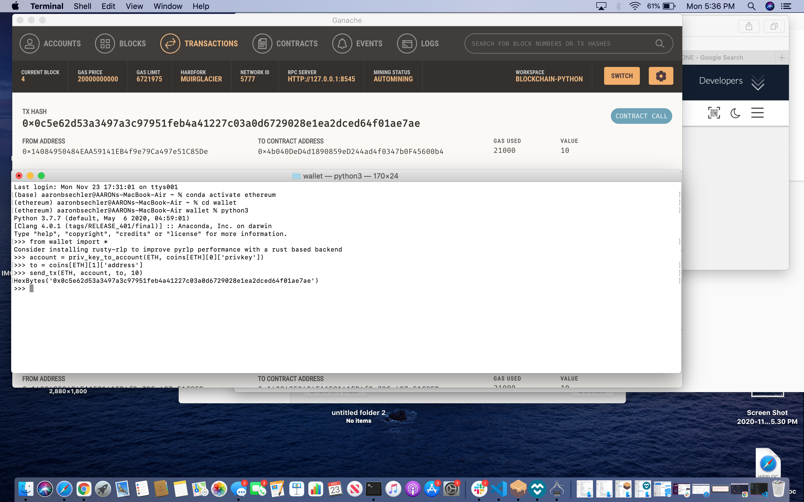
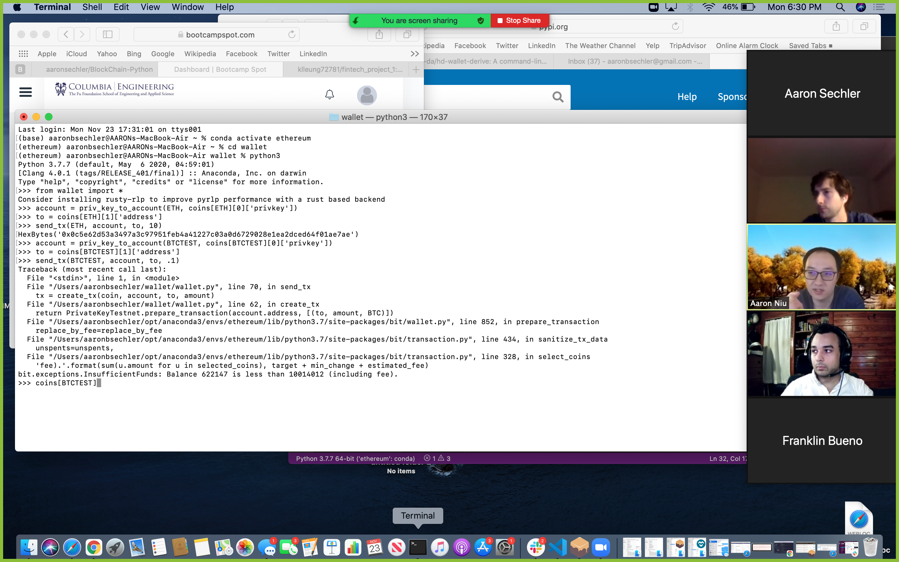

# BlockChain-Python

This wallet can be used to create multiple accounts derived from a menmonic capable of sending and receiving cryptocurrency. Since the mnemonic will generate the same addressess here as it will in other programs it can be python with other applications like MyCrypto and Ganache to send more than one type of currency. The wallet was created using the my-wallet-hd command line tool and uses bit to send BTCTEST transactions and web3 to send Ethereum Transactions.

Sending an Ethereum transaction with python is simple. Open a terminal and navigate to the folder on the hard drive that contains the wallet and then launch python with the command python3 and import everything from the wallet folder into python with the command from wallet import * and the wallet.py file will create three wallets for both Bitcoin Test and Ethereum. wallet.py has a function thatcreates an account, and using account = priv_key_to_account(ETH, coins[ETH][0]['privkey']) will save the account number of the account that you want to send Ethereum from. You can then use to = coins[ETH][1]['address'] to get the address of the wallet you're sending currency to. Once those are set you can use send_tx(ETH, account, to, 10) to send Ethereum, with the number at the end of the parenthesies being the amount of Ethereum you want to send. Python will return the HexBytes of the transaction, which you can use to look up the transaction later.

This would ordinarily be done with the app MyCryptoWallet, but since that doesn't work on my lovely Mac I used the same mnemonic key I used when creating the wallet in Ganache and the screenshot above shows both the python commands used to send the transaction and the record of it Ganache.

The same set of commands can be used to send BTCTEST by replacing ETH with BTCTEST, only for some reason it stopped working. A screen shot of the commands and error are below, and the wallet.py file and the wallet folder are attached.

